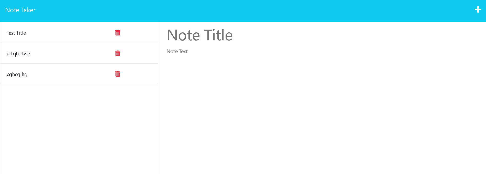

# Note Taker Back End

## Description

This Note Taker project provided experience working with pre-existing front end code, while developing and testing connections in the back end. when opened, the app allows you to see previously created notes, and create and save new notes. currently, the delete button functionality is still in progress.

## Screen Shots

## Links
[GitHub]https://github.com/Matt0Stark/note_taker

[Heroku]https://notetakera-560e35dc41f3.herokuapp.com/

